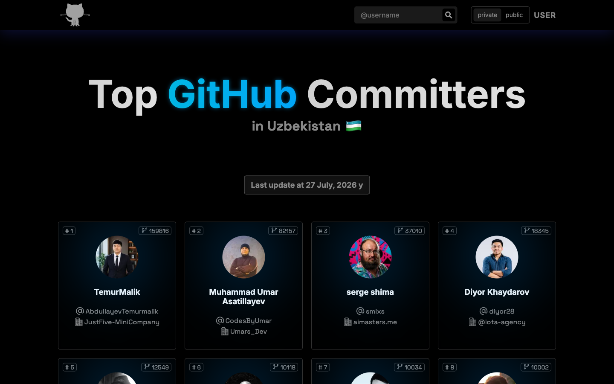
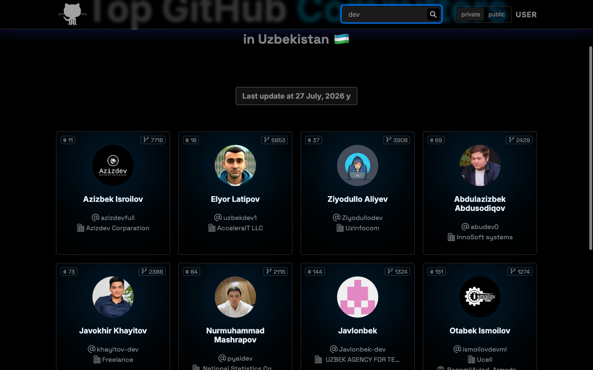

# Top GitHub Committers — Uzbekistan

A leaderboard of the most active GitHub users in Uzbekistan, ranked by contribution
count. Built with Next.js, deployed on Vercel, and refreshed automatically — the
ranking is never more than a day behind its upstream source.

<p align="center">
  <a href="https://topgithubusers.vercel.app/"><strong>Live site →</strong></a>
</p>


---

## Features

- **Two rankings.** `public` counts public contributions only; `private` also counts
  contributions to private repositories. Each is a separate upstream ranking, not a
  client-side re-sort.
- **Instant search.** Filters the loaded set by GitHub login, no round trip.
- **Enriched cards.** Rank, contribution count, avatar, login, company and
  organizations — the last two pulled from the GitHub GraphQL API.
- **Self-healing data.** A daily workflow refreshes the snapshot; the page also
  re-fetches upstream every six hours. If the source goes down, the committed
  snapshot is served instead, so a bad network never breaks a build.

| Private contributions | Search |
| --- | --- |
|  |  |

---

## Getting started

Requires Node.js 22+ and pnpm 11 (pinned via the `packageManager` field).

```bash
git clone https://github.com/ismoilovdevml/top-commits.git
cd top-commits
pnpm install
pnpm dev
```

The app reads the committed snapshot at [`src/data/committers.json`](src/data/committers.json),
so it works offline out of the box.

### Scripts

| Command | What it does |
| --- | --- |
| `pnpm dev` | Development server on `localhost:3000` |
| `pnpm build` | Production build |
| `pnpm start` | Serve the production build |
| `pnpm lint` | ESLint via `next lint` |
| `pnpm typecheck` | `tsc --noEmit` across `src/` and `scripts/` |
| `pnpm data:build` | Regenerate `src/data/committers.json` |

---

## Where the data comes from

Rankings and contribution counts come from [committers.top](https://committers.top/uzbekistan),
which recomputes them every few days from the GitHub API.

| Surface in the UI | Upstream |
| --- | --- |
| `public` tab | `https://committers.top/uzbekistan_public` |
| `private` tab | `https://committers.top/uzbekistan_private` |
| "Last update at …" | `data_asof` in `https://committers.top/rank_only/uzbekistan.json` |

Those pages carry no `company` or `organizations`, so both fields are resolved
separately through the GitHub GraphQL API — 50 users per aliased query, roughly
eight requests for the ~380 unique logins across both rankings. A login that no
longer exists comes back as a `null` alias and is skipped; the rest of the batch
still lands.

Regenerate the snapshot locally:

```bash
GITHUB_TOKEN=$(gh auth token) pnpm data:build
```

Without a token the script still succeeds — it simply carries `company` and
`organizations` over from the previous snapshot instead of refreshing them.

> [!NOTE]
> An earlier version of this app called `commiters.vercel.app`, a third-party
> mirror that has been frozen at **2023-04-24** ever since. The app kept working
> and kept serving three-year-old data. Do not point it back there.

---

## How it stays fresh

Three independent mechanisms, each covering the failure mode of the one before it:

```text
committers.top ──┬── daily GitHub Action ── commit snapshot ── Vercel redeploy
                 │
                 └── ISR revalidate (6h) ── live page refresh
                                              │
                     src/data/committers.json ┘ (fallback if upstream fails)
```

1. **[`.github/workflows/update-data.yml`](.github/workflows/update-data.yml)** runs
   daily, rebuilds the snapshot with GraphQL enrichment, and commits it only if the
   ranking actually changed. The commit is what triggers a redeploy.
2. **ISR.** [`getStaticProps`](src/pages/index.tsx) revalidates every six hours, so
   the page picks up upstream changes between deploys without waiting for a build.
3. **Fallback.** If the live fetch throws — network error, non-200, or a parsed row
   count below the sanity threshold — the committed snapshot is served and the error
   is logged. The build never fails on a transient upstream problem.

The rendered "Last update at …" date always reflects the data actually being served,
so staleness is visible rather than silent.

---

## Architecture

```text
src/
├── data/committers.json      generated snapshot (committed)
├── lib/committers.ts         upstream fetch, HTML parsing, sanity checks
├── pages/index.tsx           ISR data loading + fallback
├── components/               Navbar, HeroTitle, Card, SearchContext
└── types/Committers.ts       shared types
scripts/
└── build-data.ts             snapshot generator (GraphQL enrichment)
```

The parser in [`src/lib/committers.ts`](src/lib/committers.ts) targets a stable
table row on committers.top:

```html
<tr id="login">
  <td>1.</td>
  <td><a href="https://github.com/login">login</a><br>(Full Name)</td>
  <td>144661</td>
  <td class="photo"></td>
</tr>
```

The display name is optional, contribution counts may carry thousands separators,
and avatars are requested at `s=40` upstream — all three are normalised on parse.
If a page yields fewer than 50 rows the parser throws rather than returning a
half-empty leaderboard.

### Adding another country

`committers.top` publishes the same three URLs for every country. Change `COUNTRY`
in [`src/lib/committers.ts`](src/lib/committers.ts), rerun `pnpm data:build`, and
the rest follows.

---

## Tech stack

Next.js (Pages Router) · React · TypeScript · Sass Modules · next-seo · pnpm

## Contributing

Issues and pull requests are welcome. Before opening a PR, please run:

```bash
pnpm lint && pnpm typecheck && pnpm build
```

## License

[GPL-3.0](LICENSE)
