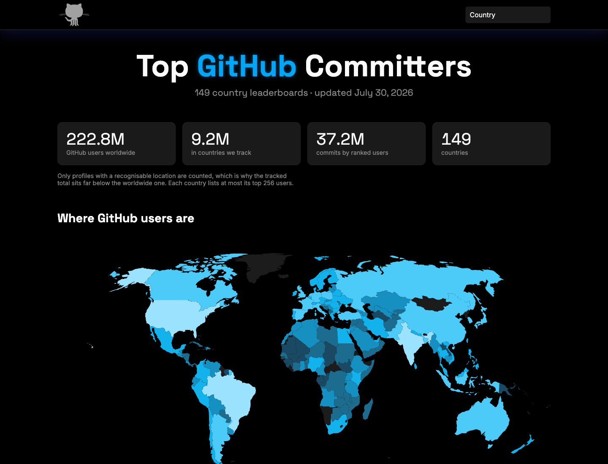
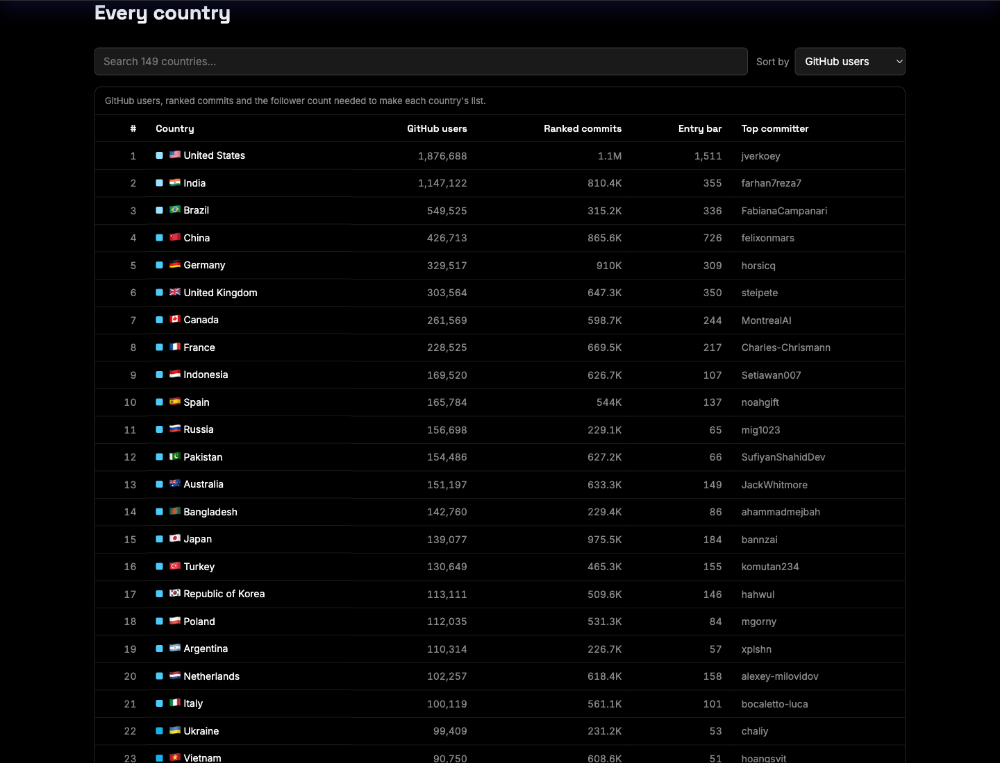
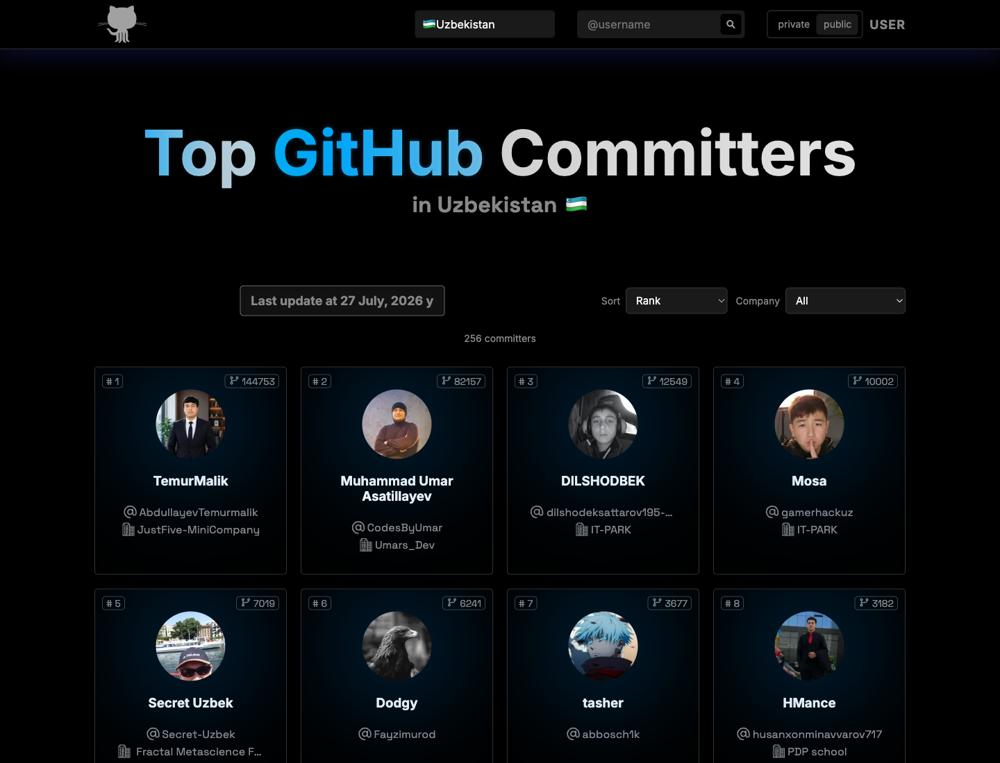
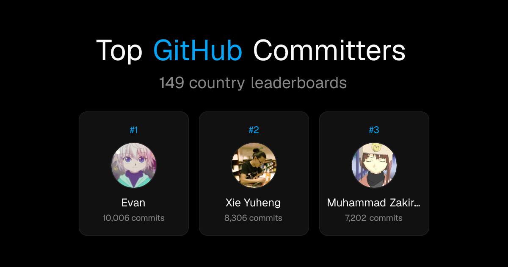

# Top GitHub Committers

Leaderboards of the most active GitHub users, ranked by contribution count, for
**151 countries**. Built with Next.js, deployed on Vercel, and refreshed
automatically — a ranking is never more than a day behind its upstream source.

<p align="center">
  <a href="https://top-commits.vercel.app/"><strong>Live site →</strong></a>
</p>



---

## Features

- **A choropleth of where GitHub users are.** 143 countries drawn, shaded by user
  count, hoverable and clickable through to each leaderboard.
- **149 countries.** Central Asia is prerendered and snapshot-backed; every other
  country committers.top publishes renders on first request and is then cached.
- **Two rankings.** `public` counts public contributions only; `private` also counts
  contributions to private repositories. Each is a separate upstream ranking, not a
  client-side re-sort.
- **Filters that live in the URL.** Search, ranking type, sort order and company are
  all query parameters, so a filtered view is shareable and the back button works.
- **Enriched cards.** Rank, contribution count, avatar, login, company and
  organizations — the last two pulled from the GitHub GraphQL API.
- **Per-country link previews.** Open Graph cards are generated at the edge and
  show that country's current podium.
- **Self-healing data.** A daily workflow refreshes the snapshots; pages also
  re-fetch upstream every six hours. If the source goes down, the committed
  snapshot is served instead, so a bad network never breaks a build.

| Every country, searchable and sortable | A country leaderboard |
| --- | --- |
|  |  |

Link previews are rendered per country by `/api/og`:



---

## Getting started

Requires Node.js 22+ and pnpm 11 (pinned via the `packageManager` field).

```bash
git clone https://github.com/ismoilovdevml/top-commits.git
cd top-commits
pnpm install
pnpm dev
```

The app reads the committed snapshot at [`src/data/committers.json`](src/data/committers.json),
so it works offline out of the box.

### Scripts

| Command | What it does |
| --- | --- |
| `pnpm dev` | Development server on `localhost:3000` |
| `pnpm build` | Production build |
| `pnpm start` | Serve the production build |
| `pnpm lint` | ESLint (flat config) |
| `pnpm typecheck` | `tsc --noEmit` across `src/` and `scripts/` |
| `pnpm data:build` | Regenerate everything under `src/data/` |

`data:build` writes four things: the country index, the projected world map, the
per-country stats, and one committer snapshot per prerendered country.

---

## Where the data comes from

Rankings and contribution counts come from [committers.top](https://committers.top/),
which recomputes them every few days from the GitHub API.

| Surface in the UI | Upstream (`<c>` = country slug) |
| --- | --- |
| `public` tab | `https://committers.top/<c>_public` |
| `private` tab | `https://committers.top/<c>_private` |
| "Last update at …" | `data_asof` in `https://committers.top/rank_only/<c>.json` |
| Country switcher, map, stats | the `<a>` list on `https://committers.top/`, plus the totals sentence on each `_public` page |

Those pages carry no `company` or `organizations`, so both fields are resolved
separately through the GitHub GraphQL API — 50 users per aliased query, roughly
eight requests for the ~380 unique logins across both rankings of one country. A
login that no longer exists comes back as a `null` alias and is skipped; the rest
of the batch still lands.

Regenerate every snapshot locally:

```bash
GITHUB_TOKEN=$(gh auth token) pnpm data:build
```

Without a token the script still succeeds — it simply carries `company` and
`organizations` over from the previous snapshots instead of refreshing them.

### Flags

`scripts/flags.ts` derives flag emoji by reversing `Intl.DisplayNames` over every
two-letter code, which covers 145 of the 151 slugs without a hand-written table.
Two failure modes are handled explicitly: ICU still resolves withdrawn codes
(`SU` for Russia, `ZR` for Congo-Kinshasa), and some slugs use a name ICU does
not emit (`turkey` vs "Türkiye"). The builder logs any slug it could not resolve.

> [!NOTE]
> An earlier version of this app called `commiters.vercel.app`, a third-party
> mirror that has been frozen at **2023-04-24** ever since. The app kept working
> and kept serving three-year-old data. Do not point it back there.

---

## How it stays fresh

Three independent mechanisms, each covering the failure mode of the one before it:

```text
committers.top ──┬── daily GitHub Action ── commit snapshots ── Vercel redeploy
                 │
                 └── ISR revalidate (6h) ── live page refresh
                                              │
                       src/data/committers/ ──┘ (fallback if upstream fails)
```

1. **[`.github/workflows/update-data.yml`](.github/workflows/update-data.yml)** runs
   daily, rebuilds the snapshots with GraphQL enrichment, and commits them only if a
   ranking actually changed. The commit is what triggers a redeploy.
2. **ISR.** [`loadLeaderboard`](src/lib/leaderboard-data.ts) revalidates every six
   hours, so pages pick up upstream changes between deploys without waiting for a
   build.
3. **Fallback.** If the live fetch throws — network error, non-200, or a parsed row
   count below the sanity threshold — the committed snapshot is served and the error
   is logged. The build never fails on a transient upstream problem.

Countries without a committed snapshot have no fallback, so a failure there returns
a 404 with `revalidate: 600` rather than a cached permanent 404 — a transient outage
cannot bury a country until the next deploy.

The rendered "Last update at …" date always reflects the data actually being served,
so staleness is visible rather than silent.

---

## Architecture

```text
src/
├── data/                       all generated by `pnpm data:build`
│   ├── countries.json            151 slugs, titles and flags
│   ├── stats.json                per-country users, entry bar, top committer
│   ├── world-map.json            projected SVG paths
│   └── committers/<slug>.json    one snapshot per prerendered country
├── lib/
│   ├── committers.ts           upstream fetch, HTML parsing, sanity checks
│   ├── countries.config.ts     prerender list, slug validation
│   ├── countries.ts            country lookups over countries.json
│   ├── leaderboard-data.ts     live fetch with snapshot fallback
│   ├── stats.ts                colour ramp, buckets, number formatting
│   └── use-leaderboard-params.ts  filter state in the URL
├── pages/
│   ├── index.tsx               "/" — map, stats, country table
│   ├── [country].tsx           every leaderboard, fallback: "blocking"
│   └── api/og.tsx              edge-rendered Open Graph cards
├── components/                 Navbar, CountryPicker, WorldMap, CountryTable,
│                               Leaderboard, Card, Seo
└── types/Committers.ts         shared types
scripts/
├── build-data.ts               data generator (GraphQL enrichment)
├── build-map.ts                projection + name→slug matching
└── flags.ts                    slug → flag emoji
```

### Routing

`/` is the global index — map, headline stats and the country table. Every
leaderboard lives at `/[country]`. Only the snapshot-backed countries are in
`getStaticPaths`; the other ~144 use `fallback: "blocking"`, so build time stays
flat as the list grows.

### The map

Country outlines are projected at build time by
[`scripts/build-map.ts`](scripts/build-map.ts) with `d3-geo` and a 110m atlas, and
written to `src/data/world-map.json` as finished SVG path strings — none of those
packages reach the browser bundle. Features are matched to committers.top slugs by
name using the same slugify rules the flag table uses, which links 143 of them; the
builder logs any leaderboard left without a shape. Six city-states (Singapore, Hong
Kong, Macau, Malta, Bahrain, Mauritius) are too small for a 110m atlas and appear
only in the table.

The fill is a sequential single-hue ramp, monotone in lightness and anchored light
enough that its lowest step still reads against the black surface (2.20:1). It is
validated with ordinal colour checks — do not reorder or re-step it without
re-running them.

The parser in [`src/lib/committers.ts`](src/lib/committers.ts) targets a stable
table row on committers.top:

```html
<tr id="login">
  <td>1.</td>
  <td><a href="https://github.com/login">login</a><br>(Full Name)</td>
  <td>144661</td>
  <td class="photo"></td>
</tr>
```

The display name is optional, contribution counts may carry thousands separators,
and avatars are requested at `s=40` upstream — all three are normalised on parse.
If a page yields fewer than 50 rows the parser throws rather than returning a
half-empty leaderboard.

### Prerendering another country

Every country already works on demand. To give one a committed snapshot — which
adds `company`/`organizations` enrichment and an offline fallback — add its slug
to `PRERENDERED_COUNTRIES` in
[`src/lib/countries.config.ts`](src/lib/countries.config.ts), add the matching
import to [`src/lib/leaderboard-data.ts`](src/lib/leaderboard-data.ts), and rerun
`pnpm data:build`.

---

## Tech stack

Next.js 16 (Pages Router) · React 19 · TypeScript · Sass Modules · @vercel/og · d3-geo · pnpm

## Contributing

Issues and pull requests are welcome. Before opening a PR, please run:

```bash
pnpm lint && pnpm typecheck && pnpm build
```

## License

[GPL-3.0](LICENSE)
